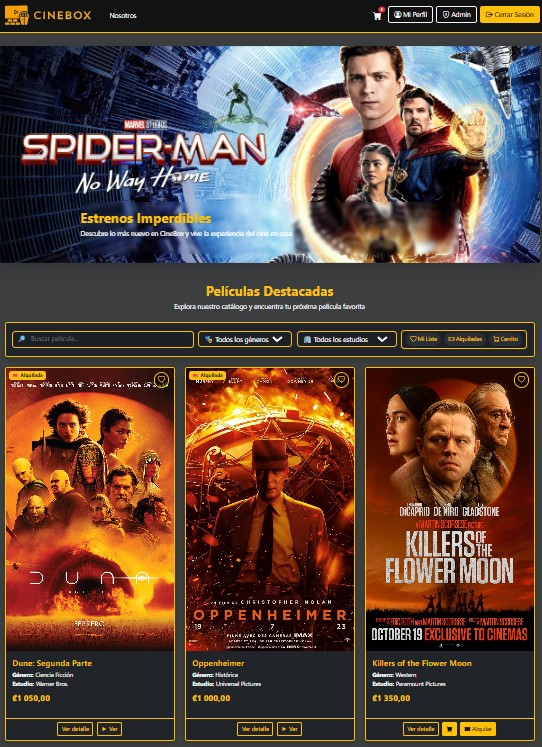
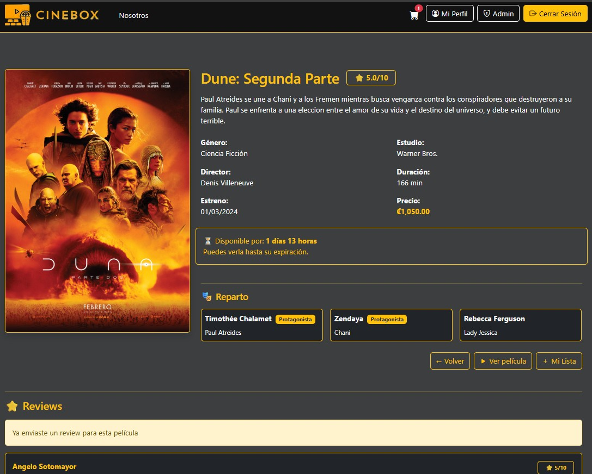
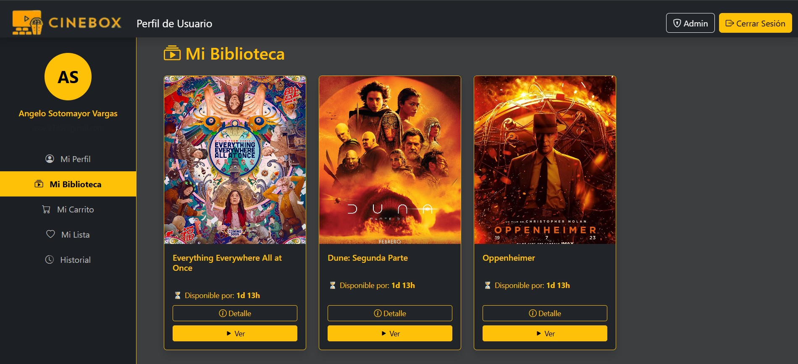
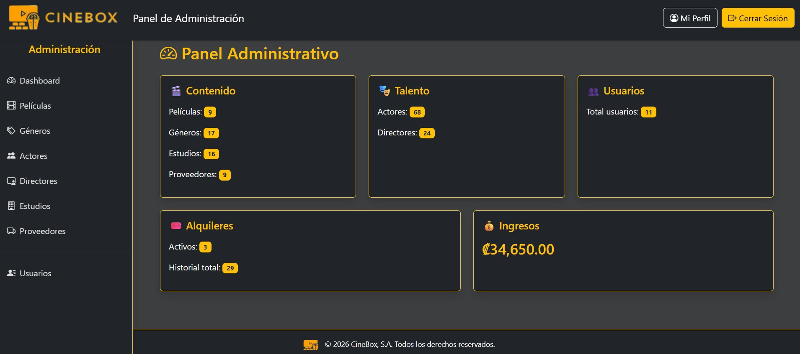

# CineBox

**CineBox** is a movie rental web app, built with a PHP MVC architecture and an Oracle Autonomous Database, deployed on a real cloud server.

---

## About the project

CineBox simulates a movie rental service ("videoteca"): visitors browse a public catalog, registered users can build a cart, rent movies for a limited time, leave reviews, and keep a list of favorites, while administrators manage the full catalog (movies, actors, directors, studios, genres, providers) and users from a dedicated panel.

Almost all business logic (rental expiration, cart consolidation, catalog filtering, admin reporting) lives directly in **PL/SQL** stored procedures and packages, with PHP acting mostly as an HTTP/session layer on top of it.

---

## Main features

- **Public catalog** with live search, filtering by genre/studio, and pagination — no page reloads, backed by AJAX endpoints.
- **Accounts**: registration, login, and session handling.
- **Favorites list** and **shopping cart**, both persisted per user in the database.
- **Rentals** with a real expiration window (countdown shown in "My Library"), automatically expired by a scheduled job.
- **Reviews & ratings** per movie.
- **Admin panel**: full CRUD for movies, genres, actors, directors, studios, and providers; user management with role assignment; a per-user "active rentals" view.
- Responsive, dark-themed UI (Bootstrap 5 + vanilla JavaScript).

---

## Tech stack

**Backend**
- PHP 8.1, no framework — a small hand-rolled MVC (`routes/` → `controllers/` → `models/` → `views/`).
- OCI8 (PHP's native Oracle extension) for all database access.

**Database**
- Oracle Autonomous Database (Always Free tier).
- Business logic implemented directly in PL/SQL: stored procedures, packages, functions, triggers, and a `SYS_REFCURSOR`-based pattern for returning result sets to PHP.

**Frontend**
- Bootstrap 5, Bootstrap Icons.
- Vanilla JavaScript (`fetch`-based AJAX, no build step).
- DataTables for the admin panel's listing tables.

**Infrastructure & cloud**
- Hosted on an **Oracle Cloud Infrastructure (OCI)** Always Free compute instance (Oracle Linux 9)
- **Apache + PHP-FPM**, connected to the Autonomous Database through an Oracle Wallet (mutual TLS)
- **HTTPS** via Let's Encrypt / Certbot
- Public domain via **DuckDNS**
- Scheduled maintenance (rental expiration) via a `cron` job

---

## Cloud architecture

```
Browser
   │  HTTPS
   ▼
Oracle Cloud VM (OCI Always Free — Oracle Linux 9)
 ┣ Apache (reverse proxy, TLS termination)
 ┗ PHP-FPM ── OCI8 / Oracle Wallet (mTLS) ──▶ Oracle Autonomous Database (Always Free)
```

The application server and the database both run on Oracle Cloud's Always Free tier — no paid infrastructure involved. All connectivity to the database goes through a Wallet-based mutual-TLS connection rather than an open network port, and the same codebase runs unmodified on both Windows (local development) and Linux (production).

---

## Project structure

```
CineBox/
 ├── controllers/     # Request handlers, one per resource
 ├── models/          # Database access layer — one class per entity, calls PL/SQL
 ├── views/           # PHP templates (public/, admin/, perfil/, layouts/, partials/)
 ├── routes/          # Front-controller style routing (web.php)
 ├── middleware/      # Admin-only route guard
 ├── config/          # .env loader, DB bootstrap, shared constants
 ├── css/ · js/       # Static assets, no bundler
 ├── cron/            # Scheduled maintenance scripts
 └── database/        # Reference copy of the full PL/SQL schema
```

---

## Screenshots

<p align="center">
  
</p>
<p align="center"><em>Public catalog with search and filters</em></p>

<p align="center">
  
</p>
<p align="center"><em>Movie detail, cast, and reviews</em></p>

<p align="center">
  
</p>
<p align="center"><em>User profile — "My Library"</em></p>

<p align="center">
  
</p>
<p align="center"><em>Admin panel</em></p>

---

## Live demo

CineBox is deployed and publicly reachable at:

**[https://cinebox-app.duckdns.org](https://cinebox-app.duckdns.org)**

---

## Multilanguage

This README is available in:
- [English](README.md)
- [Español](README.es.md)
